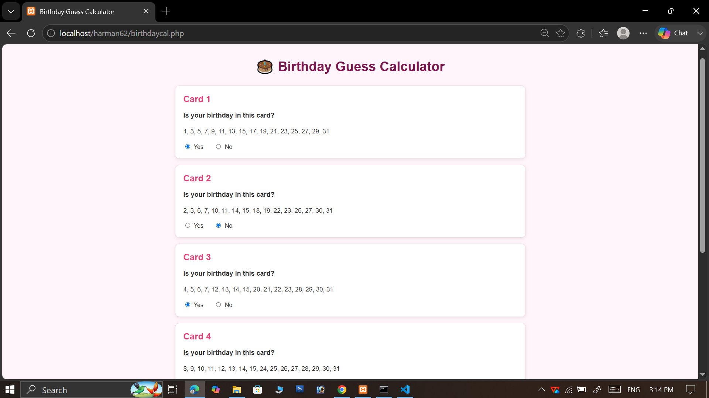
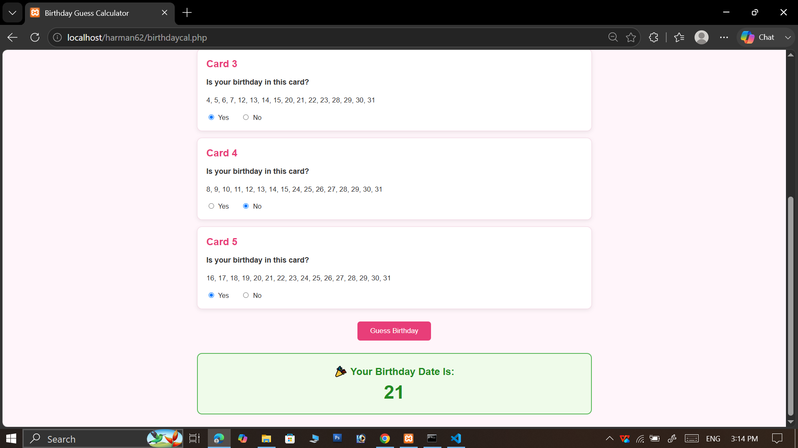

# Birthday Guess Calculator

## Student Details

- Roll Number: 2442962
- Name: Harman Kaur
- Project Name: Birthday Guess Calculator
- Technology: HTML, CSS, PHP

## Project Objective

The objective of this mini-project is to develop a simple PHP
application that predicts the user's birth date from 1 to 31
by asking five Yes/No questions using binary number cards.

The system uses five cards containing different combinations
of numbers from 1 to 31. Each card represents a binary value.

The user answers whether their birthday is present in each card.
The application then adds the values of the cards for which the
user answered "Yes" and displays the predicted birth date.

## Features

- Five binary number cards
- Five Yes/No questions
- Birth date prediction from 1 to 31
- Binary number concept
- Radio-button based answer selection
- Automatic birthday calculation
- Simple and attractive web interface
- Responsive CSS design
- Result displayed after submission
- No database required
- Runs using PHP and XAMPP

## Algorithm / Flowchart

### Algorithm

1. Start the application.
2. Display five binary number cards.
3. Ask the user whether their birthday is present in Card 1.
4. If the answer is Yes, add the value 1.
5. Ask the user whether their birthday is present in Card 2.
6. If the answer is Yes, add the value 2.
7. Ask the user whether their birthday is present in Card 3.
8. If the answer is Yes, add the value 4.
9. Ask the user whether their birthday is present in Card 4.
10. If the answer is Yes, add the value 8.
11. Ask the user whether their birthday is present in Card 5.
12. If the answer is Yes, add the value 16.
13. Add all selected binary values.
14. Display the final sum as the predicted birth date.
15. Stop.

### Flowchart

```text
START
  |
  v
Display Card 1
  |
  v
User selects Yes/No
  |
  v
Add 1 if Yes
  |
  v
Display Card 2
  |
  v
User selects Yes/No
  |
  v
Add 2 if Yes
  |
  v
Display Card 3
  |
  v
User selects Yes/No
  |
  v
Add 4 if Yes
  |
  v
Display Card 4
  |
  v
User selects Yes/No
  |
  v
Add 8 if Yes
  |
  v
Display Card 5
  |
  v
User selects Yes/No
  |
  v
Add 16 if Yes
  |
  v
Calculate Total
  |
  v
Display Predicted Birth Date
  |
  v
END
```

## Binary Number Concept

The main concept used in this project is the binary number system.

Five binary values are used:

| Card | Binary Value |
|------|-------------:|
| Card 1 | 1 |
| Card 2 | 2 |
| Card 3 | 4 |
| Card 4 | 8 |
| Card 5 | 16 |

These values are powers of 2:

```text
1, 2, 4, 8, 16
```

The maximum value that can be represented is:

```text
1 + 2 + 4 + 8 + 16 = 31
```

Therefore, five cards are sufficient to represent every number
from 1 to 31.

## Number Cards

### Card 1

Card 1 represents the value 1.

```text
1, 3, 5, 7, 9, 11, 13, 15,
17, 19, 21, 23, 25, 27, 29, 31
```

### Card 2

Card 2 represents the value 2.

```text
2, 3, 6, 7, 10, 11, 14, 15,
18, 19, 22, 23, 26, 27, 30, 31
```

### Card 3

Card 3 represents the value 4.

```text
4, 5, 6, 7, 12, 13, 14, 15,
20, 21, 22, 23, 28, 29, 30, 31
```

### Card 4

Card 4 represents the value 8.

```text
8, 9, 10, 11, 12, 13, 14, 15,
24, 25, 26, 27, 28, 29, 30, 31
```

### Card 5

Card 5 represents the value 16.

```text
16, 17, 18, 19, 20, 21, 22, 23,
24, 25, 26, 27, 28, 29, 30, 31
```

## How the Application Works

The application asks five Yes/No questions.

Each question corresponds to one binary value:

```text
Question 1 → 1
Question 2 → 2
Question 3 → 4
Question 4 → 8
Question 5 → 16
```

When the user selects "Yes", the corresponding value is added.

When the user selects "No", zero is added.

The final total represents the user's birth date.

## Example

Suppose the user has birthday date 13.

The binary representation of 13 is:

```text
13 = 8 + 4 + 1
```

Therefore the user will answer:

```text
Card 1 → Yes
Card 2 → No
Card 3 → Yes
Card 4 → Yes
Card 5 → No
```

The PHP calculation becomes:

```text
1 + 0 + 4 + 8 + 0 = 13
```

Therefore the application displays:

```text
Your Birthday Date Is: 13
```

## PHP Implementation

The application uses an HTML form to collect the user's answers.

```html
<form method="post">
```

The user's selected values are received using the PHP POST method.

Example:

```php
$_POST['q1']
$_POST['q2']
$_POST['q3']
$_POST['q4']
$_POST['q5']
```

The birthday is calculated by adding the five selected values:

```php
$birthday =
    $_POST['q1'] +
    $_POST['q2'] +
    $_POST['q3'] +
    $_POST['q4'] +
    $_POST['q5'];
```

The result is displayed using:

```php
echo $birthday;
```

## Technologies Used

- HTML5
- CSS3
- PHP
- PHP Forms
- PHP POST Method
- Binary Number System
- XAMPP
- Apache Server
- GitHub

## PHP Concepts Used

### 1. Variables

PHP variables are used to store the calculated birthday.

```php
$birthday
```

### 2. HTML Forms

An HTML form is used to collect the user's answers.

```html
<form method="post">
```

### 3. Radio Buttons

Radio buttons are used for Yes/No selection.

```html
<input type="radio">
```

### 4. POST Method

The selected answers are received using:

```php
$_POST
```

### 5. Conditional Statement

The program checks whether the form has been submitted.

```php
if (isset($_POST['submit']))
```

### 6. Arithmetic Operation

The selected binary values are added using the addition operator.

```php
$birthday =
    $_POST['q1'] +
    $_POST['q2'] +
    $_POST['q3'] +
    $_POST['q4'] +
    $_POST['q5'];
```

### 7. Echo Statement

The final birthday date is displayed using:

```php
echo $birthday;
```

## Project Files

```text
Birthday-Guess-Calculator/
├── birthdaycal.php
├── README.md
├── screenshot1.png
├── screenshot2.png


### birthdaycal.php

Contains the HTML form and PHP logic used to calculate the
birthday date.Contains the styling and responsive design of the application.

### README.md

Contains project information, objective, features, algorithm,
binary concept, working, technologies and instructions.

### Screenshots

Screenshots show the working interface and final predicted
birthday result.

## Steps to Run

### Using XAMPP

1. Install and open XAMPP.
2. Start Apache.
3. Create a folder named `Birthday-Guess-Calculator`.
4. Copy the project folder into:

```text
C:\xampp\htdocs\
```

5. Make sure the project files are inside the folder.
6. Open a web browser.
7. Visit:

```text
http://localhost/Birthday-Guess-Calculator/
```

8. Answer all five Yes/No questions.
9. Click the `Guess Birthday` button.
10. The predicted birth date will be displayed.
11. 
## Output Screenshots

Add screenshots of:

1. Birthday Guess Calculator page showing all five cards.
2. Birthday Guess Calculator page with Yes/No answers selected.
3. Final result showing the predicted birth date.






## Advantages

- Very simple to use.
- Does not require a database.
- Uses only five questions.
- Can predict any date from 1 to 31.
- Demonstrates a practical use of binary numbers.
- Easy to run on a local PHP server.

## Limitations

- The application predicts only the date of the month.
- It does not predict the birth month or birth year.
- The user must answer all five questions.
- It is designed as an educational mini-project.

## Future Improvements

The project can be improved by adding:

- Birthday month selection.
- Complete date prediction.
- Birthday celebration animation.
- Reset button.
- More interactive UI.
- Mobile-friendly improvements.
- JavaScript-based animations.

## Learning Outcomes

After completing this project, the following concepts are understood:

- Basic PHP programming.
- HTML forms.
- Radio buttons.
- POST method.
- PHP variables.
- Conditional statements.
- Arithmetic operations.
- Binary number representation.
- CSS styling.
- XAMPP and localhost.
- GitHub repository management.

## GitHub Repository Name

```text
harman62
```

## Conclusion

The Birthday Guess Calculator is a simple PHP mini-project
that demonstrates how binary numbers can be used to represent
numbers from 1 to 31.

By answering only five Yes/No questions, the application
calculates and displays the user's birth date.

The project provides a practical understanding of PHP forms,
POST data, arithmetic operations, HTML, CSS and binary logic.
